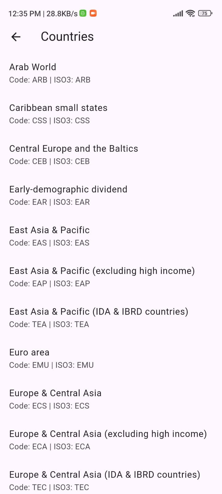
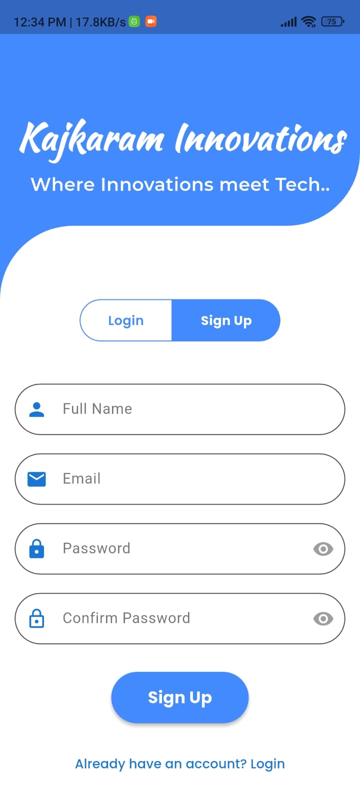
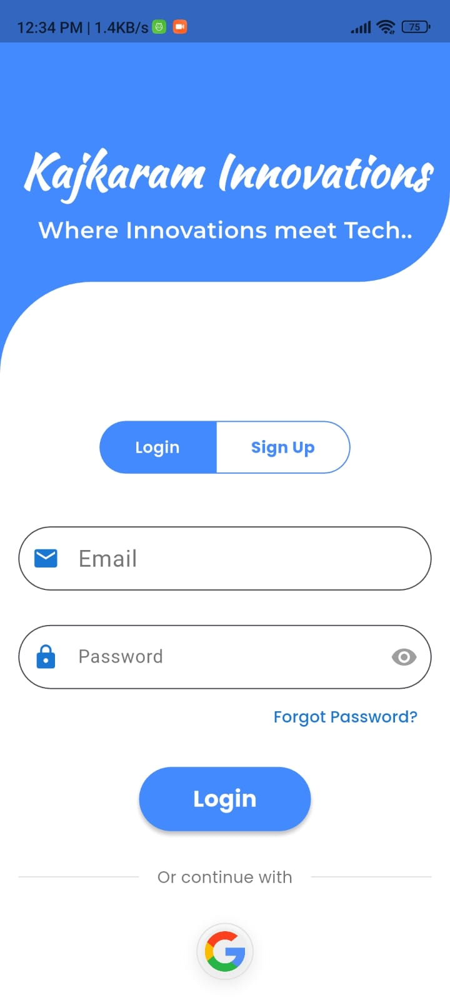

# 🔐 Flutter Authentication App

A modern and secure Flutter application that provides user authentication functionality with Firebase integration. This app features a beautiful UI with smooth animations and supports multiple authentication methods.

## ✨ Features

- **User Authentication**: Email/password and Google Sign-In
- **Modern UI/UX**: Clean, responsive design with smooth animations
- **Firebase Integration**: Secure backend authentication with Firebase Auth
- **Cross-Platform**: Works on Android, iOS, Web, Windows, macOS, and Linux
- **Country Selection**: Built-in country picker functionality
- **Form Validation**: Comprehensive input validation and error handling


## 📸 Screenshots

#### 🔐 Login Screen  
[](ss.jpg)

#### 📝 Signup Screen  
[](ss1.jpg)

#### 🏠 Home Dashboard  
[](ss3.jpg)

#### 🌍 Country Picker  
[](ss4.jpg)

---

## 🎥 Demo Video

[▶️ Watch Demo](ss5.mp4)


## 🚀 Getting Started


### Prerequisites

- Flutter SDK (^3.8.1)
- Dart SDK
- Firebase project setup
- Android Studio / VS Code

### Installation

1. **Clone the repository**
   ```bash
   git clone https://github.com/yourusername/auth.git
   cd auth
   ```

2. **Install dependencies**
   ```bash
   flutter pub get
   ```

3. **Firebase Setup**
   - Create a new Firebase project at [Firebase Console](https://console.firebase.google.com/)
   - Enable Authentication and add Email/Password and Google Sign-In providers
   - Download `google-services.json` (Android) and `GoogleService-Info.plist` (iOS)
   - Place them in the respective platform directories

4. **Run the app**
   ```bash
   flutter run
   ```

## 📱 Screenshots

- **Login Screen**: Clean authentication interface with Google Sign-In
- **Signup Screen**: User registration with form validation
- **Home Screen**: Welcome dashboard after successful authentication
- **Country Selection**: Interactive country picker

## 📁 Project Structure

```
lib/
├── main.dart              # App entry point
├── firebase_options.dart  # Firebase configuration
├── screens/
│   ├── login.dart         # Login screen
│   ├── signup.dart        # Signup screen
│   ├── homescreen.dart    # Home dashboard
│   └── countriesPage.dart # Country selection
└── services/
    └── auth.dart          # Authentication service
```

## Short Description

This is a **Flutter Authentication App** that provides a complete user authentication solution with Firebase backend. The app features a modern, responsive UI with smooth animations and supports both email/password and Google Sign-In authentication methods. It includes comprehensive form validation, country selection functionality, and a clean dashboard interface. Built with Flutter 3.8+ and Firebase, it's designed to work seamlessly across all platforms (Android, iOS, Web, Desktop).


## 📄 License

This project is licensed under the MIT License - see the [LICENSE](LICENSE) file for details.

## 🤝 Contributing

1. Fork the repository
2. Create your feature branch (`git checkout -b feature/AmazingFeature`)
3. Commit your changes (`git commit -m 'Add some AmazingFeature'`)
4. Push to the branch (`git push origin feature/AmazingFeature`)
5. Open a Pull Request

## 📞 Support
If you have any questions or need help, please open an issue on GitHub.
Made with ❤️ by [Anant Kumar Singh](https://github.com/AnantKumarSingh26)
